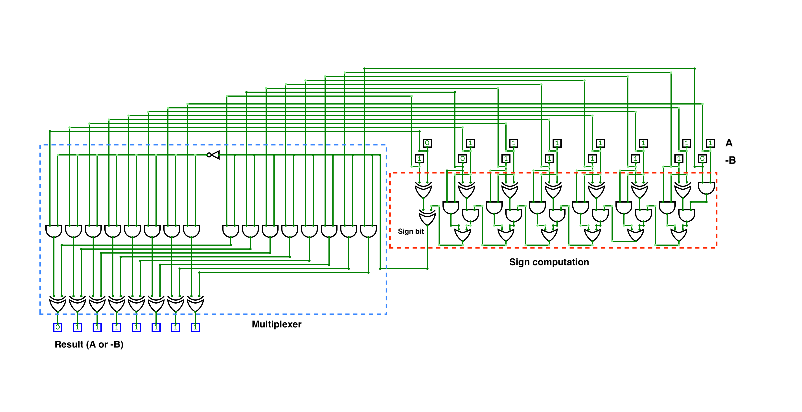

# Yao's protocol implementation for Multi-Party Computation

This is a simple implementation of [Yao's garbled circuit protocol](https://en.wikipedia.org/wiki/Garbled_circuit) for secure computation, realized for the *Introduction to Cybersecurity* course at the University of Klagenfurt.

This implementation computes the maximum between two sets of 32-bit integers owned by two participants, Alice (the circuit garbler) and Bob (the circuit evaluator).

The basic implementation of the protocol used was realized by Olivier Roques and Emmanuelle Risson, and can be found at [`ojroques/garbled-circuit`](https://github.com/ojroques/garbled-circuit).

## Circuit description

The maximum between two sets of integers is found by first computing the two local maximums, and then using Yao's protocol to securely computing the overall max between the two, without revealing anything about the other inputs.

The circuit used is similar to an adder: given two numbers $A$ and $B$, to determine whether $A > B$ we can just check the sign of $A - B$, which is equivalent to $A + (-B)$. In order to reduce the complexity of the circuit, $-B$ is computed locally via software, while the sum is performed by the circuit used in the protocol.

The circuit uses a repeated pattern of carry-outs from the sum of two digits (since we are not interested in the actual value of the sum, we do not use full-adders), and the last carry-out is used as a multiplexer bit to determine the sign of the sum.

## Project structure

The project is structured as follows:

- `Documentation/` contains a detailed technical documentation of the project
- `Report/` contains a brief report on Social, Ethical and Legal aspects of the usage of Multi-Party Computation (MPC), as well as some examples of real-life applications of such techniques.
- `src/` contains the actual code, mostly taken from [`ojroques/garbled-circuit`](https://github.com/ojroques/garbled-circuit), with some additions for the specific problem at hand and a script to dynamically generate the circuit. More details can be found in the documentation.

## Dependencies installation and usage

To learn in detail how to install the required dependencies and how to run the code, please refer to the technical documentation.